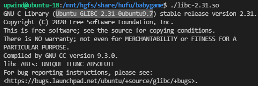
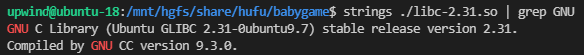
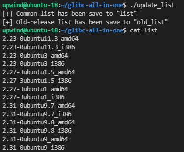
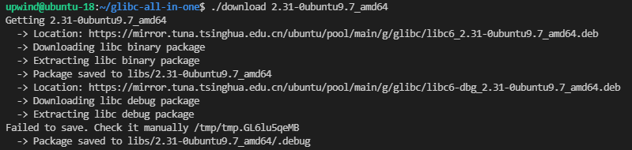
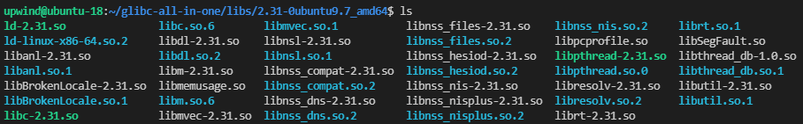
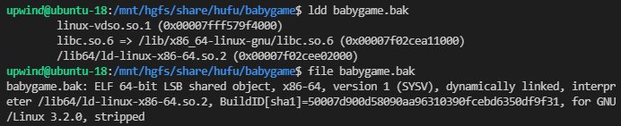
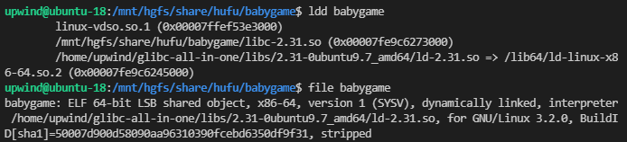

## 前言

> 参考文章：[[原创]关于不同版本 glibc 更换的一些问题-Pwn-看雪论坛-安全社区|安全招聘|bbs.pediy.com](https://bbs.pediy.com/thread-254868.htm)

在 CTF 中，我们会遇到许多提供 libc 的 Pwn 题，通常情况下我们需要在给定的 libc 环境下调试我们的 exp。当然，如果不想替换 libc 的话，也可以下载对应的 Docker 环境，或者如果你有足够的磁盘空间，也可以安装多个Ubuntu VM，这里不做赘述。

## 相关插件安装

### glibc-all-in-one

[matrix1001/glibc-all-in-one: 🎁A convenient glibc binary and debug file downloader and source code auto builder](https://github.com/matrix1001/glibc-all-in-one)

```bash
git clone https://github.com/matrix1001/glibc-all-in-one
```

### patchelf

[NixOS/patchelf: A small utility to modify the dynamic linker and RPATH of ELF executables](https://github.com/NixOS/patchelf)

```bash
git clone https://github.com/NixOS/patchelf
cd patchelf
./bootstrap.sh
./configure
make
make check
sudo make install
```

## libc 替换步骤

### 运行 libc-xx.so，查看 libc 版本



如果题目给的文件不能直接运行，那么就用 `strings xxx | grep "Ubuntu GLIBC"` 查看 libc 版本。



### 通过 glibc-all-in-one 下载对应的 libc

获取 libc 的方法有镜像站手动下载和自动化工具下载，这里我们使用自动化工具 `glibc-all-in-one` 来下载获取 libc 及其符号表。

```bash
cd glibc-all-in-one
./update_list
#更新libc列表
cat list
cat old_list
```

如果在 `./update_list` 时报错：

```bash
bash: ./update_list：/usr/bin/python：解释器错误: 没有那个文件或目录
```

则把文件开头的 `#!/usr/bin/python` 改为 `#!/usr/bin/python3` 



如果在 list 和 old_list 中都没有需要的 libc 文件，可参考后文旧版本 libc 替换。

```bash
#use download for packages in the list; use download_old for packages in the old_list.
./download 2.31-0ubuntu9.7_amd64
```



可以看到，在当前目录下出现了 `libs/2.31-0ubuntu9.7_amd64` 目录，这就是我们的 libc 文件和调试文件目录。



### 通过 patchelf 修改 elf 文件

在修改前使用 `ldd` 和 `file` 列出文件的动态库依赖关系：



通过 `patchelf` 修改 ELF 中硬编码的 libc 和 ld 的路径。

```bash
patchelf --set-interpreter /home/upwind/glibc-all-in-one/libs/2.31-0ubuntu9.7_amd64/ld-2.31.so ./babygame
patchelf --replace-needed libc.so.6 /mnt/hgfs/share/hufu/babygame/libc-2.31.so ./babygame
```

执行完 `patchelf` 之后，再次查看文件的动态库依赖关系：



这时 libc 就替换完成了，在 pwntools 中能正常运行，在 gdb 中也能正常调试。

## 旧版本 libc 替换

以上只针对最新版 libc，若题目提供的是旧版本 libc，则只能通过 https://launchpad.net 下载

```
https://launchpad.net/ubuntu/
```


待施工...

---


## libc database搭建

> 参考链接：
>
> https://libc.blukat.me/
>
> https://publicki.top/libc/

## 前言

在复现 House of Husk 的时候遇到了 libc 中找不到符号表的情况，视频教程的作者自己搭了一个带 debug 信息的 libc database search 网站，但只更新到 2020 年六月，没有新版本的 libc，于是我就找到原版的 libc database search 网站和 GitHub 仓库，想尝试自己搭建一个新版的 libc database search。

## 搭建过程

### 文件准备

先将原版的 search-libc 下载下来，把子项目 libc-database 也下载下来。

```bash
git clone https://github.com/blukat29/search-libc
cd search-libc
git submodule update --init
```

search-libc 是用 flask 框架搭建的网站外壳，真正的下载和查询功能都在子项目 libc-database 中。

### 文件修改

